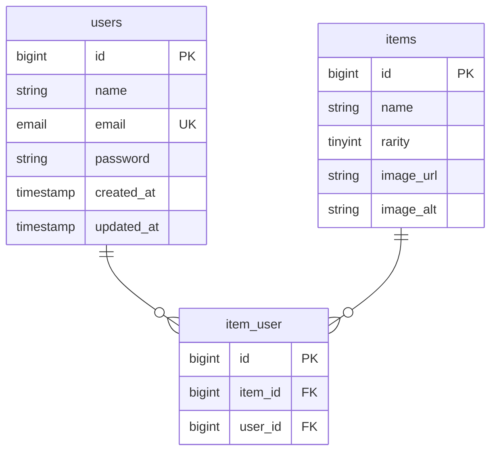

# react-spa-tutorial

```mermaid
erDiagram

users{
    bigint id PK
    string name 
    email email  UK
    string password
    timestamp created_at
    timestamp updated_at
}

items{
    bigint id PK
    string name
    tinyint rarity
    string image_url
    string image_alt
}

item_user{
    bigint id PK
    bigint item_id FK
    bigint user_id FK
}

users ||--o{ item_user : ""
items ||--o{ item_user : ""


```